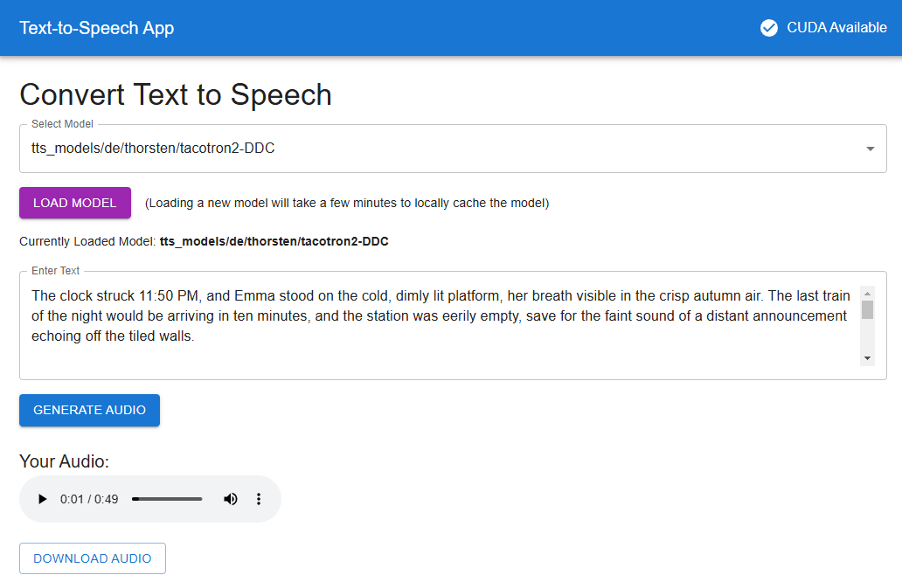

<!-- @format -->

# Text-to-Speech UI

<div align="center">

**Daikon Vox is a simple interface for Text-to-Speech generation.**

based on https://github.com/coqui-ai/TTS

</div>



## Project Overview

This project consists of:

1. **Frontend**: A React application built with Vite.
2. **Backend**: A Python 3.9 application using FastAPI and the TTS library for text-to-speech functionality.

---

## Prerequisites

Make sure the following tools are installed on your machine:

- Node.js (Latest LTS version)
- Python 3.9
- pip (Python package manager)
- Virtual environment tool (e.g., `venv`)
- `ffmpeg` (required for audio processing)

---

## Setup Instructions

### Setup 

1. **Clone the Repository**:

   ```bash
   git clone https://github.com/rscholz98/text2voice.git
   ```

### Backend Setup 

2. **Set Up a Virtual Environment**:

   ```bash
   cd backend
   python3.9 -m venv venv
   source venv/bin/activate   # On Windows: venv\Scripts\activate
   ```

3. **Install Required Dependencies**:

   ```bash
   pip install -r requirements.txt
   ```

4. **Install `ffmpeg`** (for audio processing):

   - On Linux:
     ```bash
     sudo apt install ffmpeg
     ```
   - On macOS (using Homebrew):
     ```bash
     brew install ffmpeg
     ```
   - On Windows:
     Download and install `ffmpeg` from [https://ffmpeg.org/].

---

### Frontend Setup

5. **Navigate to the Frontend Directory**:

   ```bash
   cd ../frontend
   ```

6. **Install Dependencies**:

   ```bash
   npm install
   ```

---

## Running the Application

7. Start the backend by running:

   ```bash
   cd backend
   python run.py
   ```

8. Start the frontend by running:

   ```bash
   cd frontend
   npm run dev
   ```

9. Open your browser and navigate to `http://127.0.0.1:5173` to use the application. The backend will be available at `http://127.0.0.1:8000`.

---

## Notes

- Ensure that both the frontend and backend are running simultaneously for the application to function correctly.

---

Enjoy using the application!
